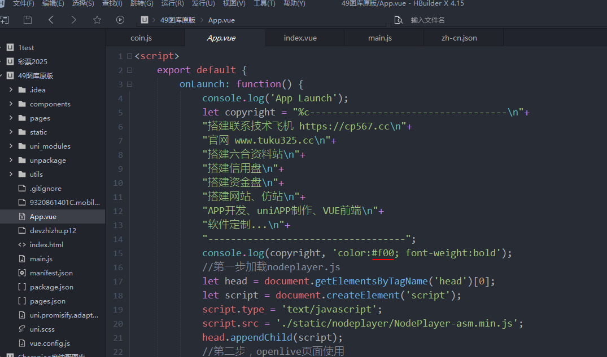

PHP+VUE澳门六合彩图库开发搭建六合彩图库网站app，是一款基于ThinkPHP+VUE的极速六合彩图库系统开发框架。

## PHP+VUE澳门六合彩图库源码是什么
PHP+VUE澳门六合彩图库源码 是基于 uniapp+Thinkphp 开发的六合彩系统开发框架，帮助开发团队和开发人员降低开发和维护成本。 PHP+VUE澳门六合彩图库源码 内置了 CMS 应用，可以直接使用。 PHP+VUE澳门六合彩图库源码 对VUE的路由，模型，配置等进行了应用层面的扩展开发，遵循VUE的约束规范开发者有开发VUE的开发经验可以直接上手。

## 搭建六合彩图库网站app
专业[搭建六合彩网站](https://www.tuku325.cc/?cate=7)、有正版49图库源码，[搭建49图库](https://www.tuku325.cc/?cate=3)；六合彩图库源码搭建六合彩图库网站，[搭建六合彩资料站](https://www.tuku325.cc/?tags=274)，搭建六合彩论坛；支持私彩，自动采集，自动更新，可搭建各种六合网站，封装APP。

## PHP+VUE澳门六合彩图库源码截图

## 主要特性

* 对Thinkphp的路由进行了应用层开发扩展，直接在后台可以设置路由并且生产菜单和权限，开发者无需在配置文件手动配置。
* 对VUE的模型进行了应用层开发扩展，直接在后台可以添加模型会自动动生产实体模型文件，包括字段，所以，关联查询等
* 集成think ，根据模型会自动生成think的增删改查，方便Api调用。
* 后台使用fastadmin，fastadmin 是一个低代码前端框架，它使用 JSON 配置来生成页面，可以减少页面开发工作量，极大提升效率。不懂前端的后台开发人员也能轻松开发复杂的后台页面。
* 集成 主流的对象储存接口，目前支持七牛，阿里云，腾讯云，华为云，后台配置好就可以使用

## 搭建六合彩图库网站app技术栈
- web技术是指通过 javaScript，HTML，css 来构建web应用的技术，mdn 提供了相关方便的文档来帮我们学习这些知识。
- Node.js 是一个基于 Chrome V8 引擎的 JavaScript 运行时，Node.js 的出现极大的推动了 javascript 的工程化。Node.js 已经是当前前端开发的基础环境，也是任何工作流开始的地方。
- Bootstrap 是全球最流行的前端开源工具包，它支持 Sass 变量和 mixins、响应式网格系统、大量的预建组件和强大的 JavaScript 插件，助你快速设计和自定义响应式、移动设备优先的站点。为了SEO CmsWing cms的前台页面使用它构建。
- GraphQL 既是一种用于 API 的查询语言也是一个满足你数据查询的运行时。 GraphQL 对你的 API 中的数据提供了一套易于理解的完整描述，使得客户端能够准确地获得它需要的数据，而且没有任何冗余，也让 API 更容易地随着时间推移而演进，还能用于构建强大的开发者工具。

## 安装使用

https://www.tuku325.cc/

## 问题反馈

https://cp567.cc/

## 特别鸣谢

## 版权信息
本项目包含的第三方源码和二进制文件之版权信息另行标注。

版权所有Copyright © 2017-2025 by tuku325 (https://www.tuku325.cc/)

All rights reserved。
